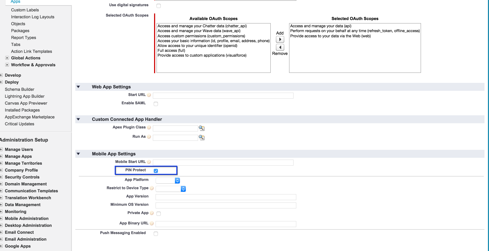
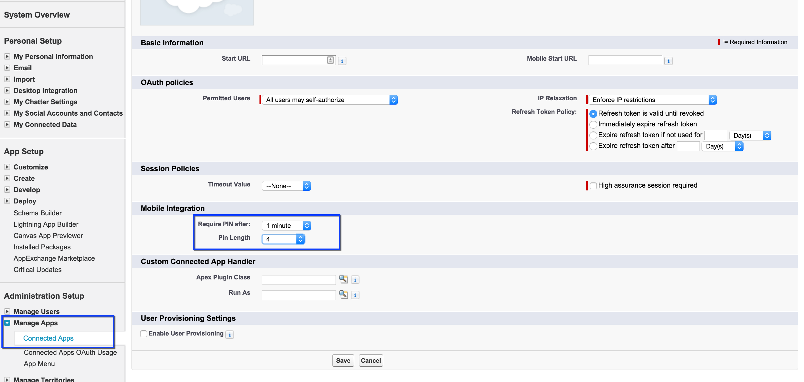
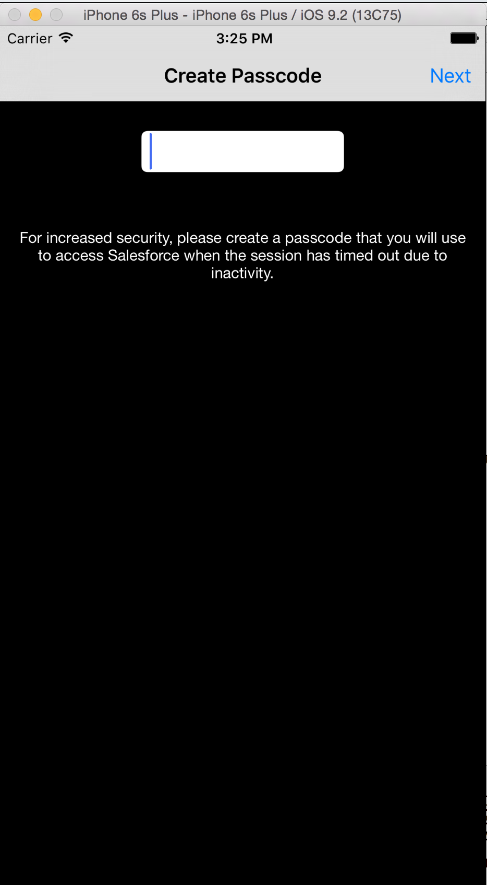

# 5. Adding PIN Protect
In this module you'll learn how to add PIN Protection to your app. PIN Protection allows your app to be more secure by asking users to enter a password(PIN) everytime the app goes to background and comes back to foreground or after a preset time frame. This PIN is not the Phone's password but a 4-10 digit number.

## Step 1: Enabling PIN Protect
To get started, you need to enable PIN Protect in Salesforce for your connected app.

1. In your Developer Edition organization, from Setup, type **apps** in the Quick Find box.
2. Under **Create**, Click on **Apps** and scroll down to **Connected Apps** section, then click **Edit** next to the `SwiftSample` connected app.
3. Enable `PIN Protect` checkbox.
4. Save.
	

## Step 2: Customize PIN Protect
You can further customize PIN's frequency and length to match your needs.

 1. While in Settings, go to "Manage Apps"
 2. Click on "Connected Apps".
 3. Click on `Edit` next to `SwiftSample`.
 4. Change **Require PIN after:** to `1 minute`.
 5. Press Save.
 

  

## Step 3: Reset And Relaunch XCode

1. Switch to Xcode
2. Stop the Xcode app if it's running (top-left corner).
3. Swith to Simulator
4. From the Simulator's menu, click on ** Simulator** then click on **Reset Content and Settings**.
5. Switch back to Xcode and run the app again.
6. Login using your developer credentials.
7. Accept OAuth screen, you'll now see **Create Passcode** screen.
	

8. Enter `1234` as passcode and press **Next**.
9.  You'll see: **Confirm Passcode** screen.

	
	
10. Enter `1234` as passcode and press **Done**.
11. You'll now enter the app.

## Step 4: Test PIN Security
1. To test PIN protect, stop the app in Xcode and rerun the app.
2. You'll see **Verify Passcode** screen.

	
	
> Note that you can trigger **Verify Passcode** screen by putting the app into background (by opening another app) and wait for the session to timeout (1 minute) and bring your Salesforce app back into foreground.

<a href="mobile-sdk-swift-adding-connected-app.html" class="btn btn-default"><i class="glyphicon glyphicon-chevron-left"></i> Previous</a>
<a href="next.html" class="btn btn-default pull-right">Next <i class="glyphicon glyphicon-chevron-right"></i></a>

