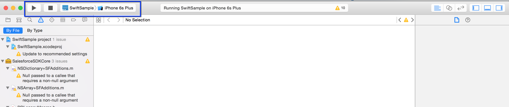
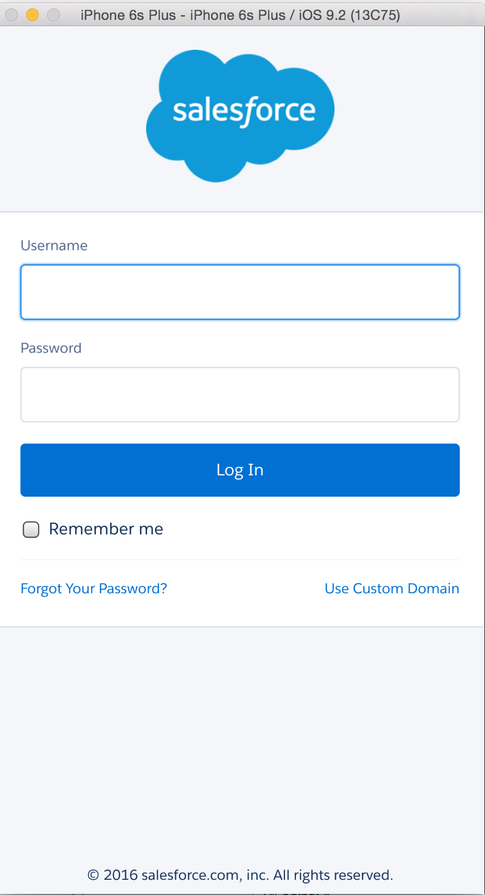
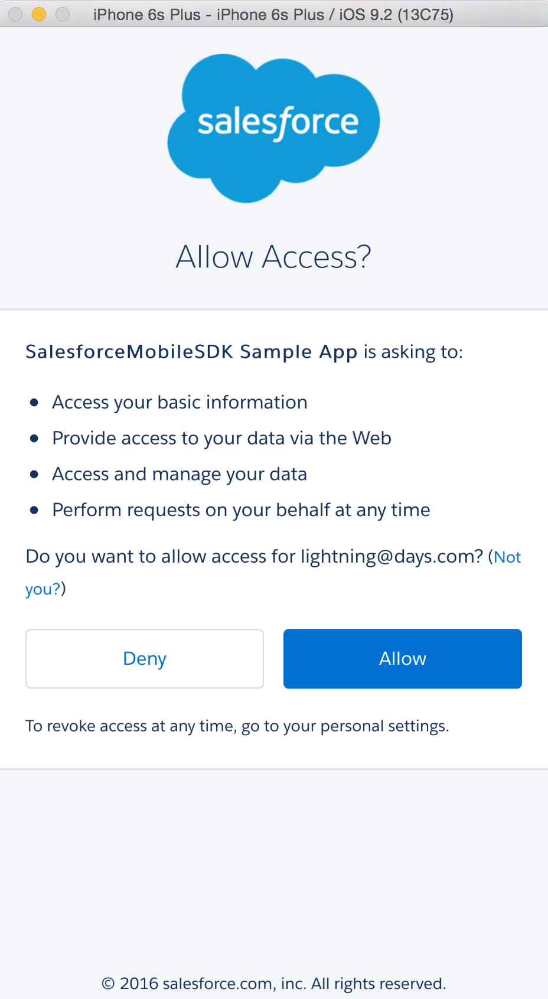
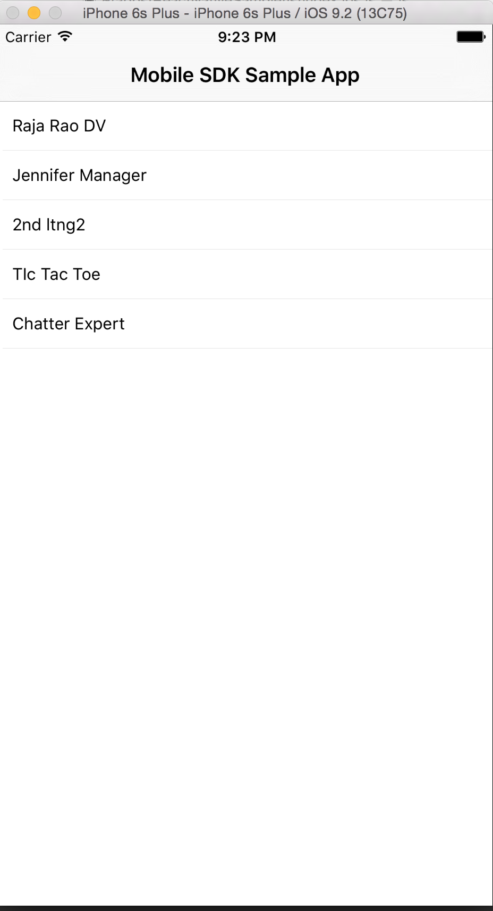

# 3. Running forceios App
In this unit, you'll run the forceios app you created earlier.

## Step 1: Start The App in Xcode
1. Change the target to "SwiftSample" (near the top left corner) 
	
	

2. Click the "Build and Run" (the "Arrow" button near the top-left corner).
3. You should see the **Simulator** app open and ask for Salesforce Login

	
	
	> Sometimes **Simulator** app opens behind the Xcode, so you may need to manually switch to it and bring it forefront. 

## Step 2: Login To Salesforce
1. Login using any Salesforce developer Org. credentials.
2. Click "Allow" in the next OAuth screen.

	
3. You should now see the sample app that shows list of Salesforce users in that Org.

	

<a href="mobile-sdk-swift-create-forceios-app.html" class="btn btn-default"><i class="glyphicon glyphicon-chevron-left"></i> Previous</a>
<a href="mobile-sdk-swift-adding-connected-app.html" class="btn btn-default pull-right">Next <i class="glyphicon glyphicon-chevron-right"></i></a>

