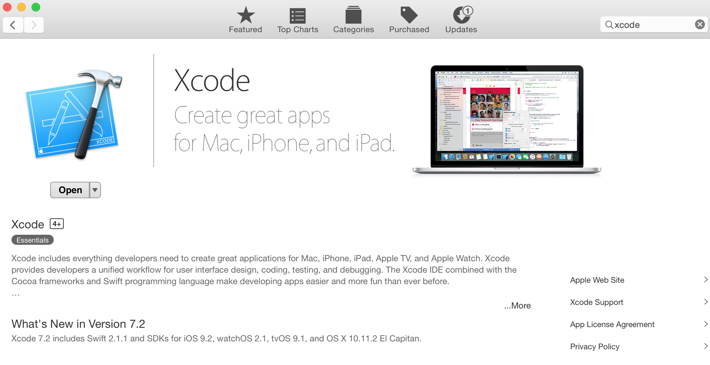

# 1. Setup Developer Environment
In this unit, you set up a developer environment to build Swift app using <a href="https://github.com/forcedotcom/SalesforceMobileSDK-iOS">Salesforce Mobile SDK</a>. You'll install quiet a lot of tools but the good news is that it's just one time setup. And after that, you'll be able to build complex Native apps using mainly React and JavaScript knowledge.

## Step 1: Install Xcode

1. Go to Apple's developer site and <a href="https://developer.apple.com/xcode/download/" target="_blank">Download Xcode</a>
2. Click on "View in the Map App Store" - This opens "App store" app on your mac.
3. Install it and then click `open` to open Xcode.

Note: Latest Xcode version is: 7.2

## Step 2: Install Node.js

Salesforce Mobile SDK's forceios tool, React and Swift all need node.js. Install Node.js if you don't have it yet. 

1. Go to <a href="https://nodejs.org" target="_blank">nodejs.org</a> and install Node.js
2. Open Terminal, and type: `node -v`, you should see current Node version.
3. Now, type `npm -v`, you should see npm's(Node Package Manager) current version. 

	> `npm` is a command line tool that is installed as part of Node.js installation and is used to install various node.js libraries including `forceios`.

## Step 3: Install CocoaPods
<a href="https://cocoapods.org/" target="_blank"> CocoaPods</a> is a dependency manager for Objective-C and Swift projects. It's similar to 'npm' in the Node.js World. Salesforce Mobile SDK uses CocoaPods to install several iOS libraries.

1. Open Terminal
2. Run: `sudo gem install cocoapods`	

	
## Additional Resources

- <a href="https://swift.org/" target="_blank">swift.org</a> 
- <a href="https://developer.apple.com/swift/resources/" target="_blank">Swift 2 Resources (Guides, Videos, Sample Code, iTunes U Courses)</a> 
- <a href="https://github.com/forcedotcom/SalesforceMobileSDK-iOS" target="_blank">SalesforceMobileSDK-iOS</a> 

<a href="index.html" class="btn btn-default"><i class="glyphicon glyphicon-chevron-left"></i> Previous</a>
<a href="mobile-sdk-swift-create-forceios-app.html" class="btn btn-default pull-right">Next <i class="glyphicon glyphicon-chevron-right"></i></a>

